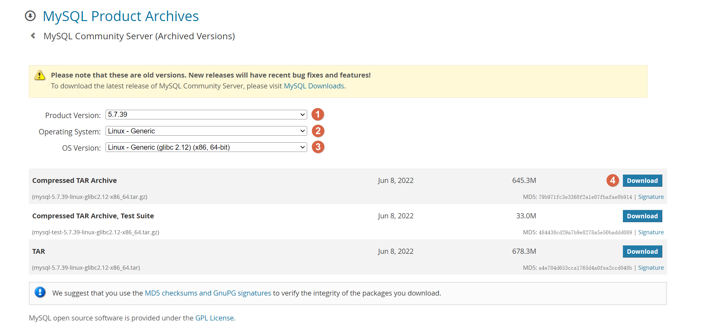

# CentOS 8.2 安装 MySQL 5.7.39

## 检查系统是否自带MySQL

::: warning 笔者说
检查系统中是否已经安装了 MySQL 或 MariaDB ，如果已经安装了，那就必须提前卸载掉它们，否则它们占用的端口号、服务名或是一些其他配置很可能会干扰到后续我们要安装的 MySQL 版本。

以前笔者就遇到过几次由这个情况引发的问题，要么是 MySQL 无法安装成功，要么是 MySQL 安装成功后输入正确密码却登录不进去。
:::

```shell
rpm -qa | grep mysql
rpm -qa | grep mariadb
# 如果上方两条命令查询出了内容，就把查出的软件卸载掉
rpm -e --nodeps 软件名
```

## 安装依赖

::: warning 笔者说
和在 Windows 系统中一样，Linux 系统中安装程序也需要准备好所需的运行库。

不确认安装好它们，那在安装 MySQL 时就会出现这样那样的依赖报错，像下面这段报错就是由于没有安装好 `libaio` 库引起的。

> /bin/mysqld: error while loading shared libraries: libaio.so.1: cannot open shared object file: No such file or directory
> :::

```shell
yum -y install numactl
yum -y install libncurses*
yum -y install libaio
```

## 下载并上传安装包

可前往 [官网](https://downloads.mysql.com/archives/community) 下载 MySQL Linux 安装包然后上传到服务器。



也可以直接在服务器内下载。

```shell
wget https://cdn.mysql.com/archives/mysql-5.7/mysql-5.7.39-linux-glibc2.12-x86_64.tar.gz
```

## 解压安装包

::: warning 笔者说
除去一些固定的东西，一定要记得根据你实际的情况调整好目录位置或命名。
:::

```shell
# 解压安装包到指定目录（如指定目录不存在则需要先提前用 mkdir 创建）
# 下方 /opt/disk 是服务器的一块数据盘挂载目录
tar -zxvf mysql-5.7.39-linux-glibc2.12-x86_64.tar.gz -C /opt/disk

# 重命名目录
cd /opt/disk
mv mysql-5.7.39-linux-glibc2.12-x86_64 mysql

# 创建 MySQL 数据存储目录
cd mysql
mkdir data
```

## 创建mysql用户组和mysql用户

```shell
# 创建 mysql 用户组
groupadd mysql

# 创建 mysql 用户
useradd -r -g mysql mysql

# 将 MySQL 安装目录授权给 mysql 用户组的 mysql 用户
chown -R mysql:mysql ./
```

## 创建配置文件

创建 my_default.cnf 配置文件。

```shell
vim /opt/disk/mysql/support-files/my_default.cnf
```

将下方内容插入到配置文件中，保存并退出编辑。

::: tip 笔者说
下方的配置中，指定了 MySQL 安装目录、MySQL 数据存储目录、MySQL 服务占用端口、MySQL 默认字符集、MySQL 日志文件位置、MySQL 进程文件位置等。

**一定记得根据你实际的情况调整好。**
:::

```shell
[mysqld]
sql_mode=NO_ENGINE_SUBSTITUTION,STRICT_TRANS_TABLES

basedir = /opt/disk/mysql
datadir = /opt/disk/mysql/data
port = 3306
socket = /tmp/mysql.sock
character-set-server=utf8

log-error = /opt/disk/mysql/data/mysqld.log
pid-file = /opt/disk/mysql/data/mysqld.pid
```

拷贝一份配置文件到 /etc 目录下，命名为 `my.cnf`。

```shell
cp support-files/my_default.cnf /etc/my.cnf
```

## 安装并启动MySQL服务

使用 `mysqld` 命令来安装 MySQL 服务，并指定好用户名、MySQL 安装目录、MySQL 数据存储目录。

```shell
bin/mysqld --initialize --user=mysql --basedir=/opt/disk/mysql/ --datadir=/opt/disk/mysql/data/
```

拷贝一份 MySQL 服务脚本到 `/etc/init.d` 目录下，命名为 `mysql`。

```shell
cp support-files/mysql.server /etc/init.d/mysql
```

启动 MySQL 服务。

```shell
systemctl start mysql
```

配置 MySQL 开机自启动。

```shell
systemctl enable mysql
```

到此，MySQL 服务就安装完成了。但别着急，还需要做些配置才能真正用起来。

## 设置环境变量

::: tip 笔者说
配置好环境变量，我们才能方便的在任何目录下使用 MySQL 的命令。
:::

```shell
# 1、打开 profile 文件
vim /etc/profile

# 2、在其中插入环境变量配置
MYSQL_HOME=/opt/disk/mysql
PATH=$MYSQL_HOME/bin:$PATH
export MYSQL_HOME PATH

# 3、重新加载 profile 文件，使最新配置生效
source /etc/profile
```

## 登录并修改密码

第一次登录时，首先从日志文件中找到随机生成的密码。

```shell
cat /opt/disk/mysql/data/mysqld.log
```

在日志文件中找到类似于下方输出的位置，其中 `8QE2NEqhB:ks` 就是密码。

```
[Note] A temporary password is generated for root@localhost: 8QE2NEqhB:ks
```

登录到 MySQL 服务端。

::: warning 笔者说
有些时候随机生成的密码包含特殊符号，例如：`&`、`/`、`.`（你没看错，有时候最后有个 `.` 可千万别当作是句子结尾。

这种密码你在登录的时候，记得用 `'` 单引号给它引起来。

例如：`mysql -uroot -p'7AB5CDadE&'`
:::

```shell
mysql -uroot -p刚才从日志中找到的随机密码
```

修改密码。

```shell
set password = password('新密码');
```

## 创建用户并授权

这一步就要根据你的实际个人需要来操作了。

```shell
grant all on *.* to root@'%' identified by '你的密码';
```
